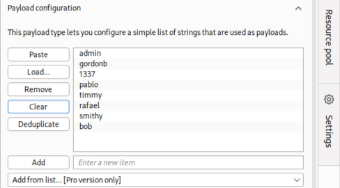
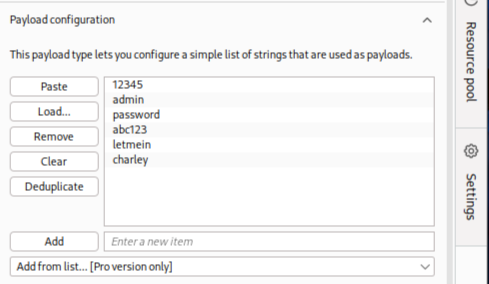
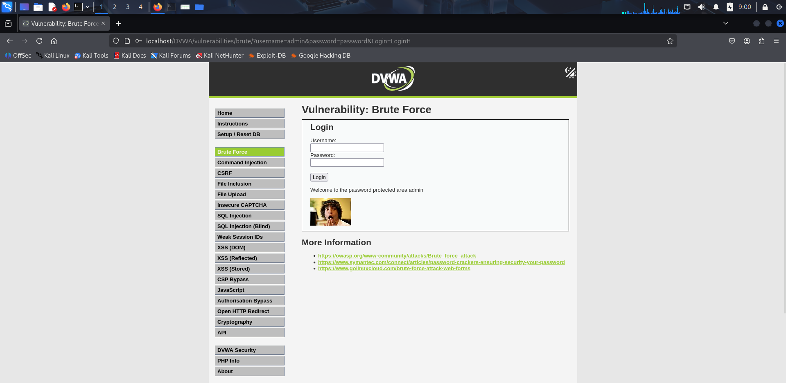
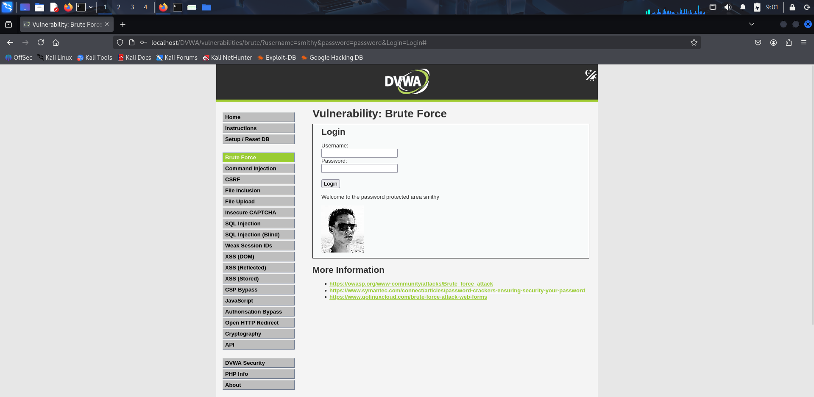
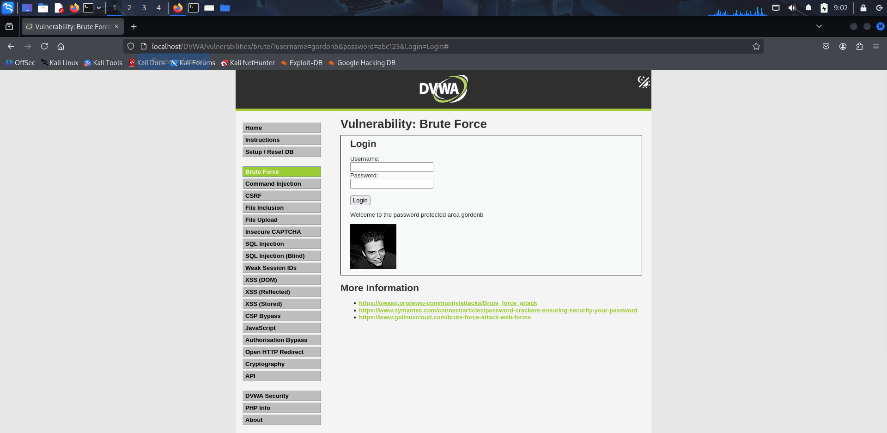
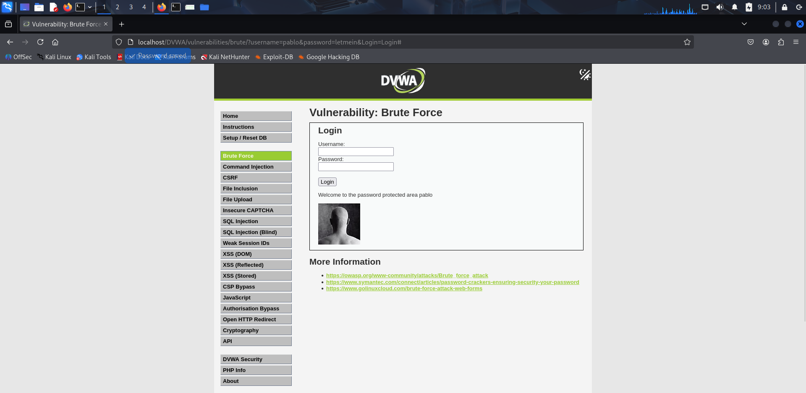
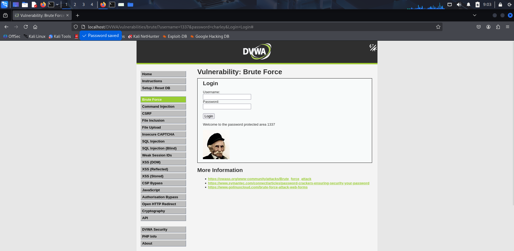

# Content Map

- [1.1 SQL Injection - Using SQLMap](#11-sql-injection---using-sqlmap)
- [1.2 SQL Injection - Manual](#12-sql-injection---manual)
- [2. Cross-Site Scripting (XSS)](#2-cross-site-scripting-xss)
  - [XSS Finding 1: Reflected XSS in `name` Parameter](#xss-finding-1-reflected-xss-in-name-parameter)
  - [XSS Finding 2: Reflected XSS via `img` Tag](#xss-finding-2-reflected-xss-via-img-tag)
  - [XSS Finding 3: Reflected XSS via `svg` Tag](#xss-finding-3-reflected-xss-via-svg-tag)
  - [XSS Finding 4: Reflected XSS via `iframe` Tag](#xss-finding-4-reflected-xss-via-iframe-tag)
  - [XSS Finding 5: Reflected XSS via `input` Tag with `type="image"`](#xss-finding-5-reflected-xss-via-input-tag-with-typeimage)
  - [XSS Finding 6: Stored XSS via `script` Injection in Message Box](#xss-finding-6-stored-xss-via-script-injection-in-message-box)
  - [XSS Finding 7: Stored XSS via `img` Tag Injection in Message Box](#xss-finding-7-stored-xss-via-img-tag-injection-in-message-box)
  - [XSS Finding 8: Stored XSS via `svg` Tag Injection in Message Box](#xss-finding-8-stored-xss-via-svg-tag-injection-in-message-box)
  - [XSS Finding 9: Stored XSS via `iframe` Tag with `javascript:` Source in Message Box](#xss-finding-9-stored-xss-via-iframe-tag-with-javascript-source-in-message-box)
  - [XSS Finding 10: Stored XSS via `marquee` Tag with `onstart` Event in Message Box](#xss-finding-10-stored-xss-via-marquee-tag-with-onstart-event-in-message-box)
- [3. Authentication Flaws – Brute Force Attack via Burp Suite](#3-authentication-flaws--brute-force-attack-via-burp-suite)


# 1.1 SQL Injection - Using SQLMap

## Summary

While testing the target web app for security issues, I found critical SQL Injection (SQLi) vulnerabilities with the help of automated tools. The main concern lies in the GET parameter `id`, which is exposed to several SQLi attack patterns. If exploited, this could lead to unauthorized access to the database, data leaks, or even affect the overall integrity of the application.

## Target Details

| Component | Details |
| :-- | :-- |
| Web Server OS | Linux (Debian) |
| Web Server Technology | Apache 2.4.63 |
| Database | MySQL (MariaDB 5.0.12+) |
| Testing Tool | SQLMap |
| Request file used | login_request.txt |

## Vulnerability Info

### 1. Vulnerable Parameter

- **Parameter:** `id` (GET request)
- **Location:** Observed in login_request.txt( It contain the raw HTTP request from the sqli page in DVWA ) during automated scanning


### 2. Injection Types Confirmed

| Method | Description | Example Payload |
| :-- | :-- | :-- |
| Time-based Blind | Server response delayed if injection is successful. | `id=admin' AND (SELECT SLEEP(5)) AND 'ZIVL'='ZIVL&Submit=Submit` |
| UNION-based Injection | Allows extraction of data by combining SELECT results. | `id=admin' UNION ALL SELECT CONCAT(...hex...),NULL-- -&Submit=Submit` |

### 3. Technical Evidence

- SQLMap confirmed the backend is **MySQL (MariaDB fork)**.
- The vulnerable endpoint responds positively to both time-based and UNION query payloads.
- Affected parameter is verified to be **injectable** using multiple techniques.


#### SQLMap Output Excerpt

```
sqlmap identified the following injection point(s) with a total of 120 HTTP(s) requests:
---
Parameter: id (GET)
    Type: time-based blind
    Title: MySQL >= 5.0.12 AND time-based blind (query SLEEP)
    Payload: id=admin' AND (SELECT 2138 FROM (SELECT(SLEEP(5)))IxYj) AND 'ZIVL'='ZIVL&Submit=Submit

    Type: UNION query
    Title: Generic UNION query (NULL) - 2 columns
    Payload: id=admin' UNION ALL SELECT CONCAT(0x716b787871,0x4e617a516e5462456a65504151506b4b67637744755153716b5041736f6b4d65596c777176754b62,0x716a717171),NULL-- -&Submit=Submit
---
web server operating system: Linux Debian
web application technology: Apache 2.4.63
back-end DBMS: MySQL >= 5.0.12 (MariaDB fork)
```


## Potential Impact

- Attackers can pull out sensitive stuff like user details, passwords, and more.
- There’s a chance the database could get tampered with; data might be changed, wiped out, or messed up.
- If login credentials are leaked, it could lead to deeper system breaches.
- These kinds of issues can hit hard, breaking compliance rules and damaging the brand’s image.


## Recommended Mitigation

- Always use prepared statements that securely handle query parameters.
- Strictly validate and sanitize all user inputs, especially those coming through GET/POST parameters.
- Configure database accounts with only the minimum permissions needed for the application to run.
- Avoid showing raw database errors to users, use generic and user-friendly error messages instead.


## Supporting Evidence

- Logs of SQLMap output are in the **sqlmaplogs** folder.
- raw request file used (`login_request.txt`).
- Automated tool response logs confirming vulnerability type and affected parameter.


# 1.2 SQL Injection - Manual

### Description

SQL Injection allows attackers to execute arbitrary SQL code by injecting malicious input into SQL queries.

### Payloads Used

```
' OR '1'='1  
```

- This payload uses a classic SQL injection trick. It always makes the condition true, so the website shows all user records by bypassing normal checks and displaying a list of users.


```
" OR "1"="1  
```

- Tried the same trick as above, but with double quotes. If the website doesn’t use double quotes in its SQL, this will not work so no results or nothing changes.

```
admin' --  
```

- This tries to comment out part of the SQL query to bypass login, but the website might show a blank (white) page or an error message instead.


```
' OR 'a'='a  
```

- Another version of the always-true condition. It works like the first payload and makes the site show all user records again.


```
' UNION SELECT NULL, username, password FROM users --  
```

- This tries to pull out usernames and passwords from the database with a UNION query. I guess because  the columns don’t match,  it gave blank page.

```
' UNION SELECT 1,2,3 --  
```

- This payload checks if you can run a UNION SELECT with three columns. because it failed , it  gave a blank screen.

```
' AND 1=CONVERT(int, (SELECT @@version)) --  
```

- This payload tries to create an error by making the database do something it can't like converting  text to a number). If it works, the site might show an error message. but the site showed and blank white screen.

```
' OR IF(1=1, SLEEP(5), 0) --  
```

- This is a “time-based” injection. If it works, the website reply slows down (waits 5 seconds), but you won’t see any new data on the page. but i my case it waits more than 10 sec and gave nothing means white screen.

```
'; WAITFOR DELAY '00:00:05' --
```

- This is also a timing test, but for Microsoft SQL Server. The page will pause for 5 seconds if the injection works, but won’t show any database info. Same thing happened....


### Mitigation

- Use parameterized queries (prepared statements)
- Validate and sanitize all inputs
- Disable detailed SQL error messages


## Conclusion

The web application is critically vulnerable to SQL Injection via the `id` parameter. Prompt remediation following the recommendations above is strongly advised to mitigate this risk and prevent exploitation.
___

# 2. Cross-Site Scripting (XSS)

### Description

XSS vulnerabilities allow attackers to inject and execute malicious scripts in a user’s browser, leading to session hijacking or data theft.

### Payloads Used

### XSS Finding 1: Reflected XSS in `name` Parameter

- **Page:** /dvwa/vulnerabilities/xss_r/
- **Payload Used:** `<script>alert('XSS')</script>`
- **Parameter:** name
- **Test Performed:** Entered payload in the "name" input field and submitted the form.
- **Result:** A browser alert popped up with the message "XSS". After closing the popup, the page displayed the name as **"hello"**, which confirms that user input was reflected without handling or sanitization.
- **Screenshot:**


### XSS Finding 2: Reflected XSS via `img` Tag

- **Page:** /dvwa/vulnerabilities/xss_r/
- **Payload Used:** ``
- **Parameter:** name
- **Description:** Injected a malicious image tag with an invalid source and an `onerror` handler to trigger JavaScript.
- **Result:**
    - A pop-up alert box appeared with the message "1" (from the alert).
    - Once dismissed, the page showed the text "hello" alongside a **broken image icon**, meaning the image failed to load, but the script executed, confirming a reflected XSS vulnerability.
- **Screenshot:**


### XSS Finding 3: Reflected XSS via `svg` Tag

- **Page:** /dvwa/vulnerabilities/xss_r/
- **Payload Used:** `<svg onload=alert(1)>`
- **Parameter:** name
- **Description:** Injected an SVG tag with an `onload` event handler to execute JavaScript when the element is parsed.
- **Result:**
    - A pop-up alert box appeared with the message "1" (from the alert), confirming JavaScript execution.
    - After dismissing the alert, the page displayed the text "hello".
    - There was noticeable **extra space** between the name input and the output, meaning the SVG element rendered but was invisible — confirming exploitation.
- **Screenshot:**


### XSS Finding 4: Reflected XSS via `iframe` Tag

- **Page:** /dvwa/vulnerabilities/xss_r/
- **Payload Used:** `<iframe src="javascript:alert(1)"></iframe>`
- **Parameter:** name
- **Description:** Injected an `<iframe>` element with a `javascript:` URL as the source, causing the browser to execute JavaScript code upon parsing the iframe.
- **Result:**
    - A pop-up alert box appeared with the message "1", confirming JavaScript execution.
    - After dismissing the alert, the page displayed the text "hello", along with a visible empty frame (`iframe`) below the input area — indicating that the element rendered in the DOM as part of the response.
- **Screenshot:**


### XSS Finding 5: Reflected XSS via `input` Tag with `type="image"`

- **Page:** /dvwa/vulnerabilities/xss_r/
- **Payload Used:** `<input type="image" src="javascript:alert('XSS')">`
- **Parameter:** name
- **Description:** Injected an `<input>` element of type "image" with a `src` attribute set to a `javascript:` URI, causing the browser to execute the contained JavaScript code.
- **Result:**
    - A pop-up alert box appeared with the message "XSS", confirming execution of JavaScript and thus a reflected XSS vulnerability.
    - After dismissing the alert, the page showed the text "hello" alongside the rendered image input element—visually represented next to the response.
- **Screenshot:**


### XSS Finding 6: Stored XSS via `script` Injection in Message Box

- **Page:** /dvwa/vulnerabilities/xss_s/
- **Payload Used:**
    - **Name:** `<h1>hi</h1` (truncated due to 10-character input limit)
    - **Message:** `<script>alert('Stored XSS')</script>`
- **Parameter(s):** name, message
- **Description:** A partially closed `<h1>` tag (`<h1>hi</h1`) was supplied through the **name** field, limited by the character count, and a `<script>` tag containing JavaScript was injected via the **message** field. This payload became part of the stored content and executed when the page rendered previously submitted messages.
- **Result:**
    - A pop-up alert with the message **"Stored XSS"** appeared immediately upon the page loading.
    - After dismissing the alert, the page displayed the output in the following format:

```
Name:
**hiMessage:**
```

        - This suggests that the unclosed `<h1>` from the name field altered the HTML structure, causing minimal but visible formatting issues.
        - The term `hiMessage:` appeared in **bold**, likely due to the `<h1>`’s visual impact and the page structure concatenating the name and message label.
- **Screenshot:**


### XSS Finding 7: Stored XSS via `img` Tag Injection in Message Box

- **Page:** /dvwa/vulnerabilities/xss_s/
- **Payload Used:**
    - **Name:** `<h1>hi</h1` (entered due to 10-character input limit; closing tag incomplete)
    - **Message:** ``
- **Parameter(s):** name, message
- **Description:** A partially closed `<h1>` tag was used in the **name** field to manipulate formatting. In the **message** field, an `` tag with an invalid `src` and an `onerror` handler was injected to trigger a JavaScript `alert()`. The payload was stored and executed when the application reflected the stored content.
- **Result:**
    - A pop-up alert appeared with the message **"XSS"**, confirming successful execution of stored JavaScript.
    - After dismissing the alert, the page displayed:

```
Name:
**hiMessage:**
```

    - A broken image icon (rendered from the failed `img` source) appeared next to the "hiMessage:" text, showing that the image tag was included in the DOM and executed its script.
- **Screenshot:**


### XSS Finding 8: Stored XSS via `svg` Tag Injection in Message Box

- **Page:** /dvwa/vulnerabilities/xss_s/
- **Payload Used:**
    - **Name:** `<h1>hi</h1` (partial heading tag due to 10-character input limit)
    - **Message:** `<svg/onload=alert('XSS')>`
- **Parameter(s):** name, message
- **Description:** The **name** field contained a partially closed `<h1>` tag (`<h1>hi</h1`), and the **message** field had an SVG element with an `onload` event listener designed to trigger a JavaScript alert. This payload was stored and later executed upon rendering of the submitted data.
- **Result:**
    - A pop-up alert appeared with the message **"XSS"**, confirming that the JavaScript executed successfully (stored XSS).
    - After closing the alert, the output was:

```
Name:
**hiMessage:**
```

    - There was **visible blank space** beneath the "hiMessage:" text, indicating the SVG element was rendered in the DOM with default size but without visible content—supporting successful injection even without a visible artifact like an icon.
- **Screenshot:**


### XSS Finding 9: Stored XSS via `iframe` Tag with `javascript:` Source in Message Box

- **Page:** /dvwa/vulnerabilities/xss_s/
- **Payload Used:**
    - **Name:** `<h1>hi</h1` (used because of 10-character input limit; incomplete closing tag)
    - **Message:** `<iframe src="javascript:alert(1)">`
- **Parameter(s):** name, message
- **Description:** Injected an `<iframe>` element through the **message** field with its `src` attribute set to a `javascript:` URI. This technique executes JavaScript when the iframe is loaded. A partially closed `<h1>` tag was also used in the **name** field to maintain formatting.
- **Result:**
    - A pop-up alert with the message **"1"** appeared immediately upon viewing the stored post, confirming a successful stored XSS.
    - The rendered output displayed as:

```
Name:
**hiMessage:**
```

    - A **blank iframe** appeared below the "hiMessage:" text, visually indicating that the `<iframe>` tag had been rendered on the page and the payload executed.
- **Screenshot:**


### XSS Finding 10: Stored XSS via `marquee` Tag with `onstart` Event in Message Box

- **Page:** /dvwa/vulnerabilities/xss_s/
- **Payload Used:**
    - **Name:** `<h1>hi</h1` (used due to 10-character input limit)
    - **Message:** `<marquee onstart=alert(1)>Hello</marquee>`
- **Parameter(s):** name, message
- **Description:** Injected a `<marquee>` HTML tag into the **message** field with an `onstart` event handler to trigger an alert when the marquee animation begins. The **name** field was filled with a partially closed `<h1>` tag to manipulate formatting. Since the `onstart` event fires when the marquee starts scrolling, the payload executes as soon as the element begins rendering.
- **Result:**
    - A pop-up alert appeared with the message **"1"**, confirming successful execution of stored JavaScript (stored XSS).
    - After the alert was dismissed, the rendered output on the page showed:

```
Name:
**hiMessage:**
```

    - Below "hiMessage:", the word **Hello** scrolled from **right to left**, as expected from the `<marquee>` element, confirming that the injected HTML rendered with its behavior intact.
- **Screenshot:**


### XSS Result

- Successfully triggered alert dialogs
- Stored and reflected XSS confirmed on forms and comment fields
- JavaScript payloads executed in browser without sanitization
- Vulnerabilities identified in both name and message parameters


### XSS Mitigation

- Sanitize and encode user input/output
- Use Content Security Policy (CSP) to restrict script execution
- Avoid inserting untrusted input directly into HTML/JS contexts
- Prefer safe methods like `textContent` over `innerHTML` in JavaScript
- Use frameworks that auto-escape user input (e.g., React, Angular)
- Validate input on both client and server side


## Conclusion

XSS is a common web security flaw that allows attackers to inject malicious scripts into websites, targeting users. It can lead to data theft, session hijacking, or site defacement. Prevent it by validating input, encoding output, and using security measures like CSP.

# 3. Authentication Flaws – Brute Force Attack via Burp Suite

### Objective

Test the login form of DVWA for authentication flaws, focusing on weak credentials and absence of account lockout controls.

### Methodology

- Tool Used: **Burp Suite Community Edition**
- Login URL: `http://localhost/DVWA/vulnerabilities/brute/`
- Attack Type: Brute-force using **Intruder** module
- Payload Style: Multiple username \& password combinations tested
- Attack Type Used: `Cluster Bomb` (to test all user/password combinations)


### Credentials Tested

A custom list of commonly used or guessed credentials was manually tested.




-

### Key Observations

- **Status Code:** All login attempts returned `200 OK`, making status code unreliable for detecting success.
- **Detection Method:** Successful logins were identified by changes in:
    - **Response length**
    - **Response body content** (welcome messages, absence of "Login failed")
- **Session Cookies:** Session was generated and redirected to dashboard after valid login.
- **No Lockout Mechanism:** Unlimited login attempts were allowed with no CAPTCHA, no delay, or account lockout.


### Successful Credentials Data

**Screenshots of burp suite dashboard with highlighted credentials.**


- Screenshots of successful logins

1. Username "admin" , Password "password"
   

2. Username "smithy" , Password "password"
   

3. Username "gordonb" , Password "abc123"
   

4. Username "pablo" , Password "letmein"
    

5. Username "1337" , Password "charley"
    


### Vulnerabilities Identified

- There was no account lockout after failed attempts.
- There was no rate limiting or delay between login retries.
- Weak/default credentials accepted without additional verification.
- There was no CAPTCHA or bot protection in place.


### Summary

The application is vulnerable to brute-force login attacks due to:

- Use of weak/stored credentials
- No rate limiting or lockout
- Lack of proper error differentiation
Attackers can exploit these flaws to gain unauthorized access using tools like Burp Suite or even manual guessing techniques.


### Mitigation

- Implement **rate limiting** and **IP blocking** mechanisms after several failed attempts.
- Enforce **strong password policies**.
- Add **CAPTCHA** or **2FA** at login.
- Show **generic error messages** to avoid username enumeration.
- Log and alert suspicious or repeated login attempts.


## Tools Summary

| Tool | Purpose |
| :-- | :-- |
| **Burp Suite** | Manual web vulnerability testing \& request tampering |
| **SQLMap** | Automated SQL injection discovery \& exploitation |


___

## Conclusion

This report demonstrates the exploitation of common web application vulnerabilities using DVWA in a safe environment. All vulnerabilities were successfully identified and validated using industry-standard tools. Mitigation strategies have been suggested for each to improve web application security posture.
